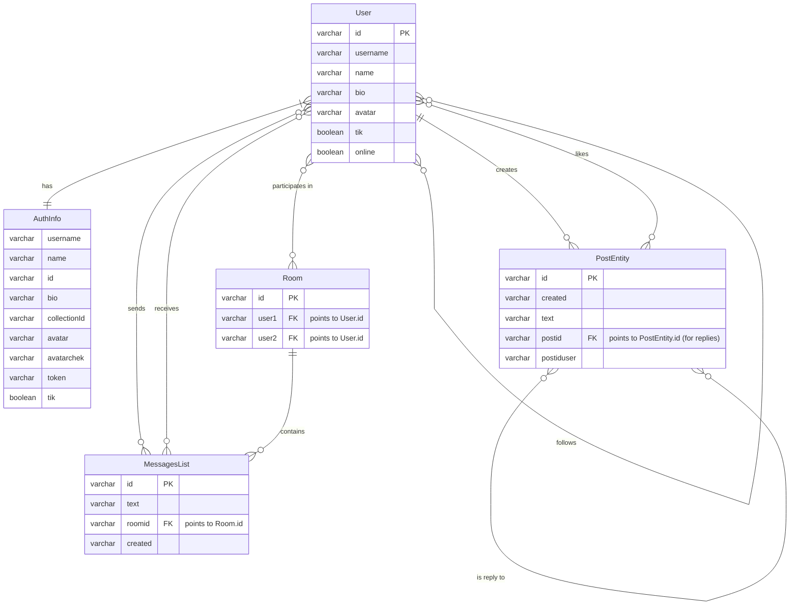

Based on the .dart files in the lib/data/model directory, I can infer the following entities and their relationships to create an Entity-Relationship (ER) diagram. These models represent the structure of the data being used in the application, primarily sourced from PocketBase collections.

Here's a breakdown of the models and their likely relationships:

User: Represents a user in the application. It has attributes like id, username, name, bio, avatar, followers (list of user IDs), following (list of user IDs), tik (boolean, possibly for verified status), and online (boolean).
AuthInfo: Represents authentication information received after login or signup. It includes user details (similar to User but specifically for the authenticated user) and a token. This is closely related to the User entity.
PostEntity: Represents a post or a reply. It has attributes like id, created, text, image (list of image URLs), user (the author of the post/reply), postid (the ID of the parent post if it's a reply), likes (list of user IDs who liked the post), and replies (list of user IDs who replied to the post).
MessagesList: Represents a message in a chat conversation. It has attributes like id, text, usersend (the sender user), usersseen (the receiver user), roomid (the ID of the chat room/conversation), and created.
LikeUser: Represents a user who liked a post. This model seems to be specifically for holding a list of User objects who liked a post, likely used when fetching likes for a post and expanding the likes field. It has a user attribute which is a list of User.
Followers: Represents the followers of a user. Similar to LikeUser, it's likely used when fetching followers for a user and expanding the followers field. It has a user attribute which is a list of User.
Following: Represents the users that a user is following. Similar to Followers, it's used when fetching following for a user and expanding the following field. It has a user attribute which is a list of User.
PostReply: A helper model to combine a reply (myReply) and its parent post (replyTo). This is likely used in the repository layer for displaying replies along with the original post they are associated with.
Based on these models and the typical relationships in a social media or messaging application, here's a possible ER diagram using Mermaid syntax:

Explanation of the ER Diagram:

Entities: User, AuthInfo, PostEntity, MessagesList, Room. Each entity is represented by a box with its attributes. The primary key (PK) is indicated for each entity.
Relationships: Lines connect the entities to show their relationships. The type of relationship (one-to-one, one-to-many, many-to-many) and cardinality (optionality) are indicated using standard ER diagram notation:
||--o{: One-to-many relationship, where the entity on the single-line side has one instance related to zero or more instances of the entity on the crow's foot side.
}o--o{: Many-to-many relationship, where instances of both entities can be related to multiple instances of the other.
}|--||: One-to-one relationship, where one instance of an entity is related to exactly one instance of another. (Used for User and AuthInfo, assuming AuthInfo is always tied to a specific user's authentication session).
Foreign Keys (FK): Indicates attributes in an entity that reference the primary key of another entity, establishing a link between them.
PostEntity.postid is a foreign key referencing PostEntity.id, representing the parent post for a reply.
MessagesList.roomid is a foreign key referencing Room.id, linking messages to a specific conversation.
Room.user1 and Room.user2 are foreign keys referencing User.id, indicating the two users in a chat room.
Relationship Explanations:

User has AuthInfo: A one-to-one relationship (in the context of an active session) where a User has associated authentication information.
User creates PostEntity: A one-to-many relationship where a User can create multiple PostEntity records (both main posts and replies).
PostEntity is reply to PostEntity: A self-referencing one-to-many relationship where a PostEntity can be a reply to another PostEntity.
User likes PostEntity: A many-to-many relationship where multiple Users can like multiple PostEntity records. This is represented in the PostEntity model by the likes list of user IDs and implicitly by the LikeUser model used for fetching expanded like data.
User follows User: A many-to-many relationship where Users can follow other Users. This is represented in the User model by the followers and following lists of user IDs and implicitly by the Followers and Following models.
User sends/receives MessagesList: A many-to-many relationship where Users send and receive multiple MessagesList records.
Room contains MessagesList: A one-to-many relationship where a Room (conversation) contains multiple MessagesList records.
User participates in Room: A many-to-many relationship where multiple Users can participate in multiple Rooms.
PocketBase Connection to the Models:

The models in this directory directly correspond to the collections and their fields in the PocketBase backend.

User model: Likely maps to a "users" collection in PocketBase with fields like username, name, bio, avatar, followers, following, tik, and online. The fromJson constructor in the User model shows how data from a PocketBase user record is parsed.
AuthInfo model: This model is specifically for handling the response from PocketBase's authentication endpoints (auth-with-password or user creation). The fromJson constructor shows it extracts data from the record and token fields of the PocketBase authentication response.
PostEntity model: Likely maps to a "post" collection in PocketBase. The fromJson constructor parses data from a PocketBase post record, including handling the expand field to get the related user record and the likes and replies lists. It also constructs the image URLs based on the PocketBase file serving convention.
MessagesList model: Likely maps to a "chat" collection in PocketBase. The fromMapson factory constructor (a different naming convention, but serves the same purpose as fromJson) parses data from a PocketBase chat record, utilizing the expand field to get the full usersend and usersseen user records.
Room (Inferred Entity): While there isn't a dedicated Room model file, the MessagesList model has a roomid and the ChatRemoteDataSource in the data source layer has an addRooomId method that interacts with a "roomid" collection. This suggests there's likely a "roomid" collection in PocketBase to manage conversations, and I've included it in the ER diagram as the Room entity with user1 and user2 fields referencing users.
LikeUser, Followers, Following models: These models are primarily used to represent the data structure when PocketBase's expand feature is used to fetch the full user records associated with the likes, followers, and following lists in PostEntity and User records.
The .g.dart file (user.g.dart) is generated by the hive_generator package. This indicates that the User model is also being used with the Hive local database (as seen in search_user_source.dart), which requires generating adapter code for serialization and deserialization.

In essence, the models in this directory are the data structures that bridge the gap between the application's logic and the data stored in PocketBase. They define how the raw data from PocketBase's API responses is structured and used within the Flutter application.